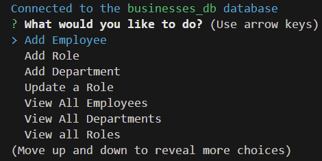

# <Your-Project-Title>Employee Tracker

## Description [](https://opensource.org/licenses/MIT)

- What was your motivation?

        To build an app with employee tracking feature.

- What problem does it solve?

        Convenience for a employer or HR office to track their employee

- What did you learn?

        MySQL database.

## Table of Contents

- [Installation](#installation)
- [Usage](#usage)
- [Credits](#credits)
- [License](#license-and-badges)
- [Additional Info](#additional-infomation)

## Installation

Run in integrated terminal with

```
npm start
```

## Usage

Choose from the choice it prompt



- Add Employee

        To add new employee, with first name, last name, and select their role, and manager if applicable

- Add Role

        To add new role with role name, salary, and select its department

- Add Department

        To add new department with its name

- Update a Role

        To update an existing employee's role/title

- View All Employees

        To view all employees with their Full name, role, department, salary, and manager

- View All Departments

        To view all department names

- View all Roles

        To view all roles

- Exit

        To exit the app

## Credits

Class REPO examples, and Wayne

## License-and-Badges

[](https://opensource.org/licenses/MIT)

---

## Features

Employee Tracker

## Tests

none

## Additional-Infomation

Github: https://github.com/wayne80361

Email: wayne80361@gmail.com

REPO LINK: https://github.com/wayne80361/Employee-Tracker-Wayne

Video Link: https://drive.google.com/file/d/15-xUQdq7AY-LFlWPq4gC1yAq_MPTNH6N/view
